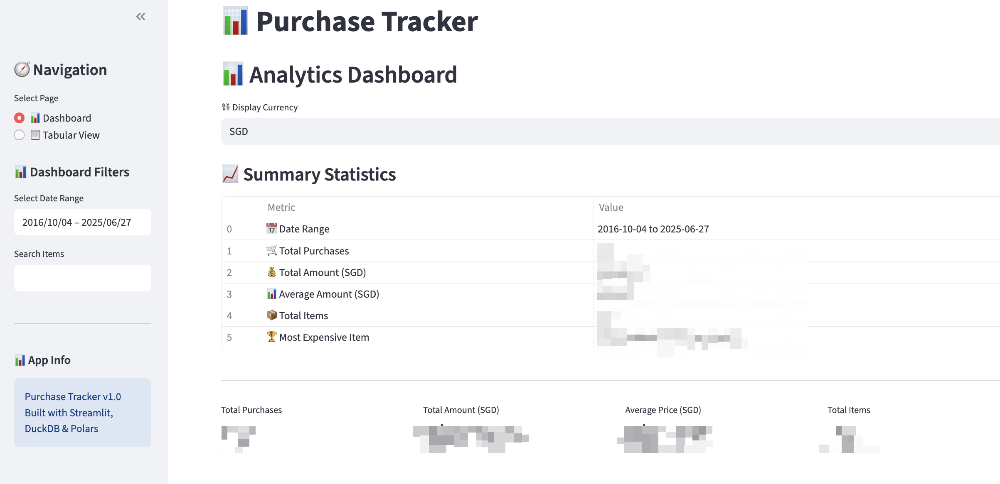

# Purchase Tracker

A modern purchase tracking application with interactive dashboard for analyzing purchase data from CSV files. Features dual-currency support (CNY/SGD) and comprehensive analytics.

## 🚀 Quick Start

### 1. Setup (One-time)

```bash
# Install uv (if not already installed)
curl -LsSf https://astral.sh/uv/install.sh | sh

# Install dependencies
uv sync
```

### 2. Add Your CSV File

Place your purchase CSV file in the `data/` folder. The CSV should have this format:

```csv
SN|date|tracking_number|companyName|itemName|quantity|quantity|itemPrice|exportStatus|orderId
1|Product Name,2025-06-27,1,173.31|4602879540926185838
```

### 3. Run the Application

```bash
# Import your CSV data
uv run python main.py import data/your-file.csv

# Start the dashboard
uv run python main.py dashboard
```

That's it! Open your browser to `http://localhost:8501` to view the dashboard.

## 📊 Dashboard Features

- **💱 Dual Currency**: Switch between CNY (¥) and SGD (S$) 
- **📈 Analytics**: Charts, trends, and summary statistics
- **📋 Data Table**: Detailed view with advanced filtering
- **🔍 Smart Filters**: Date range, price range, search by item name
- **📥 Export**: Download filtered data as CSV

## 📁 CSV Data Structure

### How to Extract CSV Data

I modified the Taobao extension found in https://github.com/pureiboi/shopping-order-extension/tree/main in order to extract the CSV file in the format shown below.

### CSV Format

The application expects CSV files with pipe-separated values (`|`):

### Required Fields

- **SN**: Serial number (integer)
- **date**: Purchase date (YYYY-MM-DD format)
- **tracking_number**: Shipping tracking number
- **companyName**: Shipping company name
- **itemName**: Product name/description
- **quantity**: Number of items purchased
- **itemPrice**: Price per item in CNY (will auto-convert to SGD)
- **exportStatus**: Order status
- **orderId**: Unique order identifier

## 🎛️ All Available Commands

```bash
# Show help
uv run python main.py

# Initialize database
uv run python main.py init

# Import CSV data
uv run python main.py import data/your-file.csv

# Start dashboard (localhost:8501)
uv run python main.py dashboard

# Start API server (localhost:8000)
uv run python main.py api
```

## 🏗️ Technical Details

**Built with modern Python stack:**
- **Database**: DuckDB (analytics-optimized)
- **Data Processing**: Polars (fast dataframes)
- **API**: FastAPI (async web framework)
- **Dashboard**: Streamlit (interactive apps)
- **Visualization**: Plotly (interactive charts)
- **Package Management**: uv (fast Python packages)

**Key Features:**
- Automatic CNY → SGD conversion (rate: 1 CNY = 0.1962 SGD)
- High-performance CSV import and processing
- Interactive analytics with real-time filtering
- Dual-page interface: Analytics + Tabular views
- Data export capabilities


## Sample Screenshots




## 📄 License

This project is open source and available under the [MIT License](LICENSE).